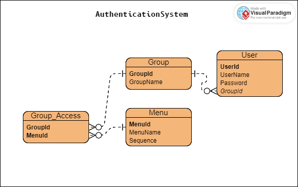

**INTERVIEW TASK FOR IT SOFTWARE DEVELOPER POSITION**

PT Shimano

{width="5.311713692038495in"
height="3.3278280839895014in"}

**Introduction**

This system not include any registration, it's handled by admin to add
and delete or update user, and assigning them to specific group.

**User**

**User** table contain all **Users** and the **Group** they're assigned
to.

  ------------------------------------------------------------------------
  **UserId**    **UserName**        **Password**          **GroupId**
  ------------- ------------------- --------------------- ----------------
  1             Admin123            \[encrypted\]         1

  2             Mark                \[encrypted\]         2

  3             John                \[encrypted\]         2

  4             Oliver              \[encrypted\]         3
  ------------------------------------------------------------------------

**Group**

**Group** table contain all **Group** of **Users**. Admin can change
every table here (Create, Read, Update, and Delete), except deleting his
own account. Every other **Group** can access only **Menu(s)** assigned
to them.

  -----------------------------------------------------------------------
  **GroupId**                   **GroupName**
  ----------------------------- -----------------------------------------
  1                             admin

  2                             sales

  3                             production
  -----------------------------------------------------------------------

**Menu**

**Menu** table contains every **Menus** that will be assigned to
**Group(s)**.

  -----------------------------------------------------------------------
  **MenuId**              **MenuName**
  ----------------------- -----------------------------------------------
  1                       Production Data

  2                       Sales Data

  3                       production
  -----------------------------------------------------------------------

**Group_Access**

**Group_Access** table, contains the actual assignment for **Groups.**

  -----------------------------------------------------------------------
  **GroupId**                        **MenuId**
  ---------------------------------- ------------------------------------
  3                                  1

  3                                  3

  2                                  2
  -----------------------------------------------------------------------
